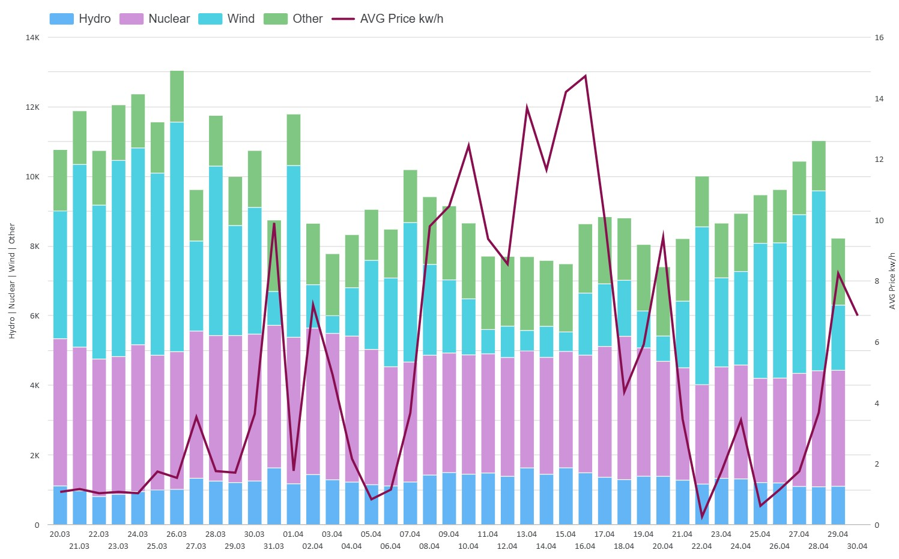

# ⚡ Finnish Energy Market Data Pipeline (End-to-End) V3.0

An automated E2E data pipeline designed to ingest, transform, and analyze the **complete Finnish electricity generation mix** (Nuclear, Hydro, Wind) alongside market spot prices. This project implements a modern Medallion Architecture (Bronze, Silver, Gold) using a cloud-native serverless stack.

### 🛠 Tech Stack
* **Languages:** Python (Pandas, SQLAlchemy, Requests)
* **Data Warehouse:** Neon (Serverless PostgreSQL)
* **Transformation:** dbt (Data Build Tool)
* **Orchestration & CI/CD:** GitHub Actions
* **BI & Visualization:** Looker Studio
* **Data Quality:** dbt tests (Schema & Business logic validation)

### 🏗 Data Architecture
* **Bronze (Raw Layer):** High-frequency data ingested from the Pörssisähkö API (prices) and Fingrid API (3-minute resolution datasets for multiple energy sources). Data is safely loaded using UPSERT strategies to prevent duplication.
* **Silver (Staging Layer):** Timezone normalization, 3-minute to hourly aggregation using `DATE_TRUNC`, and dynamic data pivoting. Computes the unmetered "Other" generation by subtracting known sources from the total system production.
* **Gold (Analytics Layer):** Final fact tables (`fct_energy_hourly`) utilizing a resilient `FULL OUTER JOIN` on timestamps. This ensures the dashboard remains unbroken even if one of the upstream APIs experiences an outage.

### 🚀 Key Engineering Features
* **Smart Rate Limiting:** Custom Python logic with exponential backoff and explicit handling of HTTP `429 Too Many Requests` to safely ingest massive amounts of historical data without overloading external APIs.
* **Resilient Data Modeling:** Designed to handle missing upstream data gracefully using `COALESCE` logic in dbt, ensuring continuous data flow to the BI layer.
* **BI-Optimized Views:** Implemented dual-source architecture in the BI layer, using both Wide and Long (Unpivoted via `CROSS JOIN LATERAL`) data formats to satisfy complex charting requirements like Stacked Area charts without fanning out the primary fact table.
* **Automated Orchestration:** Fully serverless execution via GitHub Actions scheduled daily.
* **Data Integrity:** Automated dbt tests ensuring Unique and Not Null constraints on primary keys.

### 📈 How it Works
The pipeline is triggered by GitHub Actions, which:
1. Sets up a Python environment and installs dependencies.
2. Executes `extract_load.py` to fetch up to 3 days of high-frequency data into the Bronze layer.
3. Runs `dbt run` to process the data through Silver and Gold layers.
4. Executes `dbt test` to validate the final output before the BI layer consumes it.

### 📊 Live Dashboard
The final analytics are delivered via a live Looker Studio report, featuring:
* Hourly Energy Mix dynamics (Stacked Area).
* Base load vs. spot price correlation (Scatter Analysis).
* Market overview tracking negative price occurrences.

[🔗 View Live Dashboard](https://lookerstudio.google.com/reporting/0b691455-7ee7-4980-af0b-d98efce2c83c)

---
