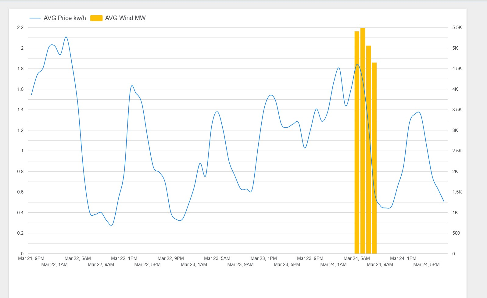

# ⚡ Finnish Energy Market Data Pipeline (End-to-End)

An automated E2E data pipeline designed to ingest, transform, and analyze Finnish electricity spot prices and wind power generation. This project implements a modern **Medallion Architecture** (Bronze, Silver, Gold) using a cloud-native serverless stack. 

## 🛠 Tech Stack
- **Languages:** Python (Pandas, SQLAlchemy, Requests)
- **Data Warehouse:** Neon (Serverless PostgreSQL)
- **Transformation:** dbt (Data Build Tool)
- **Orchestration & CI/CD:** GitHub Actions
- **Data Quality:** dbt tests (Schema & Business logic validation)

## 🏗 Data Architecture
1. **Bronze (Raw Layer):** High-frequency data ingested from **Fingrid API** and **Pörssisähkö API**.
2. **Silver (Staging Layer):** Timezone normalization (UTC to Europe/Helsinki), unit conversion, and 15-minute to hourly aggregation using `DATE_TRUNC`.
3. **Gold (Analytics Layer):** Final fact tables (`fct_energy_hourly`) joined on timestamps with computed business metrics (e.g., negative price flags).

## 🚀 Key Engineering Features
- **Incremental Processing:** Optimized dbt models using `incremental` materialization to reduce compute costs and storage overhead.
- **Robust Ingestion:** Implemented custom Python **Retry Logic** with exponential backoff to handle external API instability.
- **Automated Orchestration:** Fully serverless execution via GitHub Actions scheduled daily at 06:00 UTC.
- **Data Integrity:** Automated dbt tests ensuring `Unique` and `Not Null` constraints on primary keys and critical metrics.

## 📈 How it Works
The pipeline is triggered by GitHub Actions, which:
1. Sets up a Python environment and installs dependencies.
2. Executes `extract_load.py` to fetch new data into the **Bronze** layer.
3. Runs `dbt run` to process the data through **Silver** and **Gold** layers.
4. Executes `dbt test` to validate the final output before the BI layer consumes it.

## 📊 Live Dashboard
The final analytics are delivered via a live Looker Studio report. 
It visualizes the correlation between wind power supply and market spot prices.

[🔗 View Live Dashboard](https://lookerstudio.google.com/reporting/0b691455-7ee7-4980-af0b-d98efce2c83c)

---
*Created for portfolio purposes. Demonstrates production-grade data engineering principles.*
